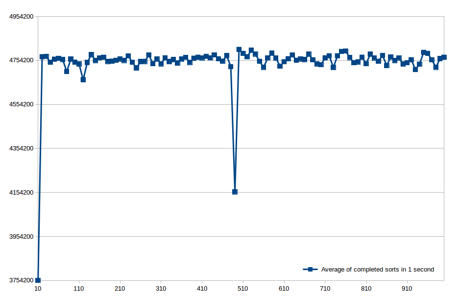

Assignment 4: Generic Classes and More Algorithms
-------------------------------------------------
`1DV507` --- Programming and Data Structures, Spring 2017.

Created by Jonas Sjöberg (`js224eh`) on 2017-03-20.

Exercise 4 -- Report
====================

Instructions
------------

> Write a short report about your experiments in Exercises 2 and 3. 
> 
> For each experiment:
> 
> * Describe how you did your experiment.
> * Show a table of your results.
> 
> Also, try to explain why `StringBuilder` is much faster than string
> concatenation using the `+` operator.

Experiment Description
----------------------
I first created some utility functions for timing and logging results to the
terminal. My main concern was that the test "harness" code should be written as
to minimize its influence on the test results.  The code that executes after
the timing measurement has started should ideally be only the code under test.
However, in order to keep track of execution time, I used a simple class
`Stopwatch` that _will_ influence the results slightly with the polling of the
`hasTimeLeft()` method. This class uses `System.nanoTime` and simply compares a
certain starting time with the current time. 

I have written a couple of games in Java and they all used `System.nanoTime` in
the main update-loop for calculating frames per second and when the graphics
should be redrawn, etc.

Each test is performed 5 times and the results are then averaged.  This is to
slightly counteract unwanted interactions from other running systems, however,
a more sophisticated setup is needed if high precision measurements are needed.
For instance, my IDE uses the Java Virtual Machine and executing the tests
through the IDE means some kind of wrapper code is used to control my running
code through GUI "Run"- and "Stop"-buttons.

It would probably be best to run the compiled classes directly from a terminal.

Results 
-------

### Integer Insertion sort
These are the results for sorting an array of integers with a varying number of
elements. Each entry is an average of 5 test runs. The randomized input array
was recreated for each test run.

| Number of elements | Average sorts in 1 second |
| ------------------:|:------------------------- |
| 10                 | 3754200.2                 |
| 20                 | 4771006.0                 |
| 30                 | 4772426.8                 |
| 40                 | 4745883.2                 |
| 50                 | 4759872.2                 |
| 60                 | 4763359.6                 |
| 70                 | 4758392.4                 |
| 80                 | 4703917.2                 |
| 90                 | 4760205.6                 |
| 100                | 4746234.6                 |
| 110                | 4738118.2                 |
| 120                | 4666381.2                 |
| 130                | 4744835.8                 |
| 140                | 4780776.2                 |
| 150                | 4753818.6                 |
| 160                | 4765462.2                 |
| 170                | 4768408.8                 |
| 180                | 4749422.0                 |
| 190                | 4750794.2                 |
| 200                | 4754578.8                 |
| 210                | 4760553.0                 |
| 220                | 4754031.2                 |
| 230                | 4774759.4                 |
| 240                | 4745591.2                 |
| 250                | 4719873.0                 |
| 260                | 4749001.6                 |
| 270                | 4749288.4                 |
| 280                | 4779075.4                 |
| 290                | 4739798.0                 |
| 300                | 4760810.2                 |
| 310                | 4738412.4                 |
| 320                | 4766032.2                 |
| 330                | 4748909.6                 |
| 340                | 4757952.4                 |
| 350                | 4742160.6                 |
| 360                | 4760459.6                 |
| 370                | 4767707.4                 |
| 380                | 4744926.2                 |
| 390                | 4764302.4                 |
| 400                | 4768640.6                 |
| 410                | 4765337.0                 |
| 420                | 4772466.6                 |
| 430                | 4765688.0                 |
| 440                | 4779106.8                 |
| 450                | 4761480.6                 |
| 460                | 4750994.8                 |
| 470                | 4776178.0                 |
| 480                | 4725735.2                 |
| 490                | 4156775.0                 |
| 500                | 4804182.2                 |
| 510                | 4786137.6                 |
| 520                | 4771041.2                 |
| 530                | 4800713.0                 |
| 540                | 4783183.8                 |
| 550                | 4750021.8                 |
| 560                | 4723033.0                 |
| 570                | 4765652.0                 |
| 580                | 4787296.6                 |
| 590                | 4764879.4                 |
| 600                | 4727655.2                 |
| 610                | 4748159.4                 |
| 620                | 4761899.8                 |
| 630                | 4778854.2                 |
| 640                | 4754629.2                 |
| 650                | 4760558.2                 |
| 660                | 4758196.8                 |
| 670                | 4782936.0                 |
| 680                | 4756894.8                 |
| 690                | 4738245.8                 |
| 700                | 4734454.2                 |
| 710                | 4765978.6                 |
| 720                | 4775113.0                 |
| 730                | 4722450.4                 |
| 740                | 4775088.8                 |
| 750                | 4794977.6                 |
| 760                | 4796759.8                 |
| 770                | 4767597.6                 |
| 780                | 4743854.4                 |
| 790                | 4747076.8                 |
| 800                | 4768802.6                 |
| 810                | 4739267.4                 |
| 820                | 4782674.8                 |
| 830                | 4765117.6                 |
| 840                | 4750533.2                 |
| 850                | 4776656.0                 |
| 860                | 4730993.0                 |
| 870                | 4769659.6                 |
| 880                | 4753782.2                 |
| 890                | 4765356.0                 |
| 900                | 4738050.6                 |
| 910                | 4743709.4                 |
| 920                | 4757214.2                 |
| 930                | 4712845.2                 |
| 940                | 4737231.0                 |
| 950                | 4790743.6                 |
| 960                | 4786095.2                 |
| 970                | 4756787.2                 |
| 980                | 4722998.0                 |
| 990                | 4762172.6                 |
| 1000               | 4768648.0                 |

### String Insertion Sort
These are the results for sorting a array of Strings with a varying number of
array elements. The individual elements always consist of 10 random lower case
characters `a-z`.

Each entry is an average of 5 test runs. The same randomized string array input
is used for each of these 5 runs.

| Number of elements | Average sorts in 1 second |
| ------------------:|:--------------------------|
| 10                 | 17106133                  |
| 20                 | 13166694                  |
| 30                 | 15767201                  |
| 40                 | 13221227                  |
| 50                 | 11267173                  |
| 60                 | 9818430                   |
| 70                 | 8592659                   |
| 80                 | 7855926                   |
| 90                 | 7035896                   |
| 100                | 6592896                   |
| 110                | 5953318                   |
| 120                | 5568380                   |
| 130                | 5285613                   |
| 140                | 4951489                   |
| 150                | 4647850                   |
| 160                | 4409888                   |
| 170                | 4223027                   |
| 180                | 3972876                   |
| 190                | 3707718                   |
| 200                | 3583197                   |
| 210                | 3411621                   |
| 220                | 3282559                   |
| 230                | 3113348                   |
| 240                | 3002491                   |
| 250                | 2876674                   |
| 260                | 2781851                   |
| 270                | 2702824                   |
| 280                | 2602525                   |
| 290                | 2484911                   |
| 300                | 2430988                   |
| 310                | 2311172                   |
| 320                | 2241993                   |
| 330                | 2149777                   |
| 340                | 2073572                   |
| 350                | 1978723                   |
| 360                | 1968559                   |
| 370                | 1881965                   |
| 380                | 1835449                   |
| 390                | 1749778                   |
| 400                | 1659853                   |
| 410                | 1638381                   |
| 420                | 1592136                   |
| 430                | 1531805                   |
| 440                | 1501505                   |
| 450                | 1470321                   |
| 460                | 1419417                   |
| 470                | 1366559                   |
| 480                | 1314707                   |
| 490                | 1272329                   |
| 500                | 1240219                   |
| 510                | 1212663                   |
| 520                | 1184661                   |
| 530                | 1159497                   |
| 540                | 1144219                   |
| 550                | 1124720                   |
| 560                | 1067747                   |
| 570                | 1053508                   |
| 580                | 1020089                   |
| 590                | 1027196                   |
| 600                | 999959                    |
| 610                | 1004881                   |
| 620                | 985926                    |
| 630                | 972301                    |
| 640                | 944730                    |
| 650                | 925484                    |
| 660                | 909604                    |
| 670                | 897190                    |
| 680                | 895279                    |
| 690                | 867277                    |
| 700                | 859045                    |
| 710                | 855416                    |
| 720                | 841285                    |
| 730                | 830285                    |
| 740                | 815246                    |
| 750                | 796289                    |
| 760                | 760258                    |
| 770                | 756852                    |
| 780                | 742243                    |
| 790                | 730205                    |
| 800                | 714224                    |
| 810                | 700064                    |
| 820                | 711382                    |
| 830                | 696108                    |
| 840                | 687980                    |
| 850                | 675596                    |
| 860                | 678745                    |
| 870                | 657384                    |
| 880                | 650219                    |
| 890                | 626909                    |
| 900                | 623421                    |
| 910                | 617825                    |
| 920                | 622137                    |
| 930                | 619309                    |
| 940                | 607235                    |
| 950                | 597177                    |
| 960                | 584603                    |
| 970                | 576172                    |
| 980                | 587490                    |
| 990                | 576554                    |
| 1000               | 569871                    |

### `StringBuilder` vs "`+`-concatenation"
After doing some non-exhaustive research, my theory is that
the `StringBuilder`-approach is equivalent to simple String concatenation with `+`
when it is performed outside of a looping structure.

The Java compiler can detect the concatenation and substitute a routine similar
to `StringBuilder`, if not `StringBuilder` itself.

However, if the concatenation is performed in a loop, the Java compiler might 
not be able to perform the optimization. In this case, the `StringBuilder` approach 
is faster due to the number of objects created.

When using `StringBuilder`, a single object is created.  When concatenation
strings with `+`, a lot of string objects must be created as the String type is
immutable.

__Sources:__  

* http://docs.oracle.com/javase/specs/jls/se8/html/jls-15.html#jls-15.18.1
* http://stackoverflow.com/questions/1532461/stringbuilder-vs-string-concatenation-in-tostring-in-java

